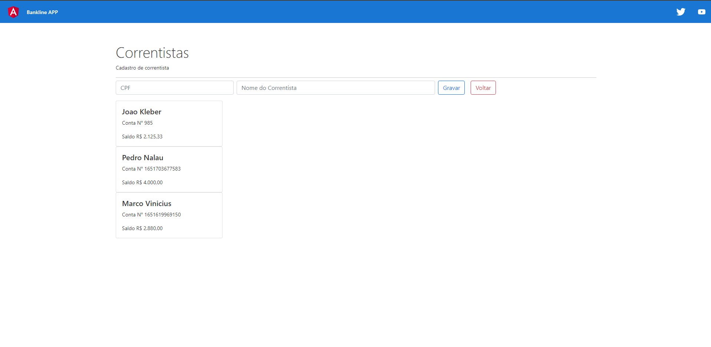
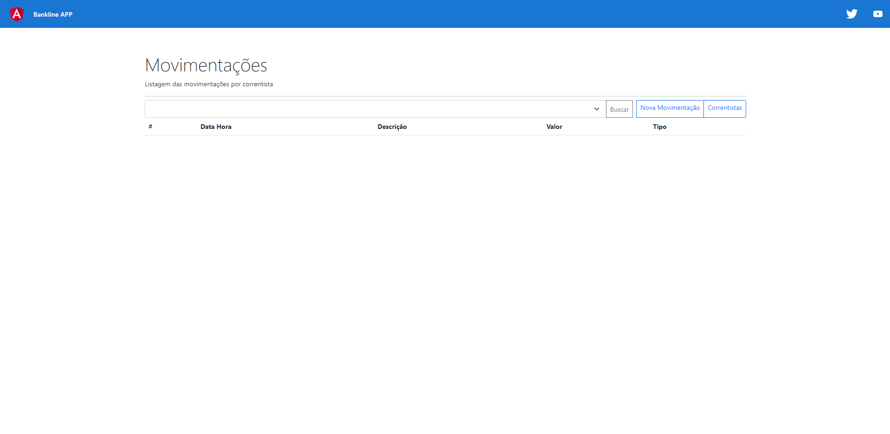
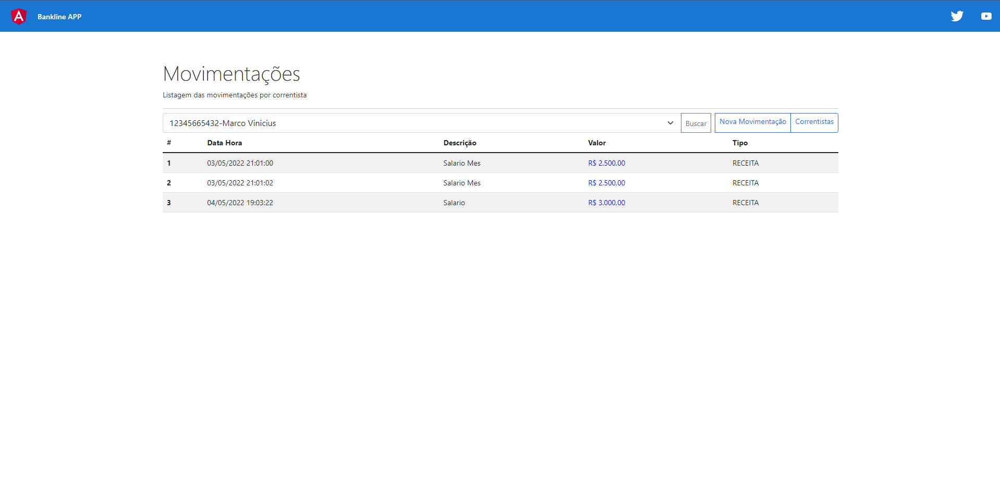
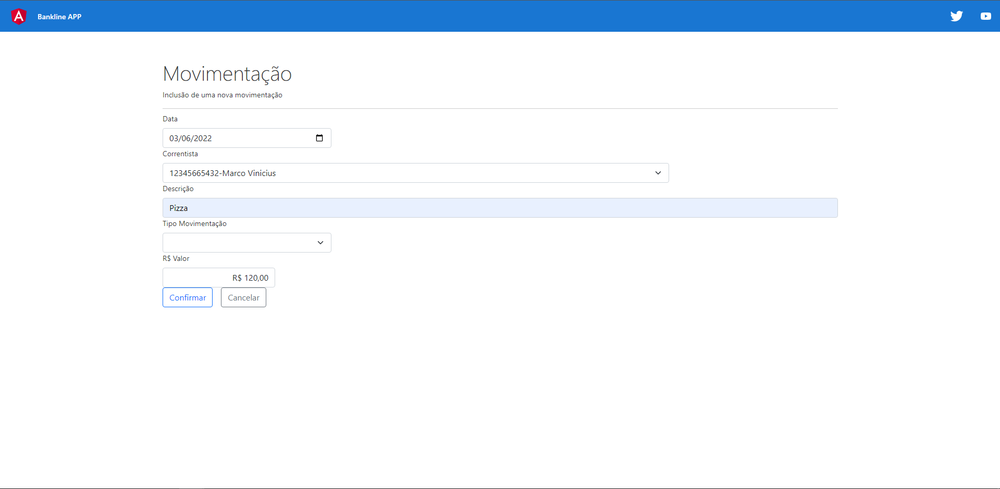

# BANKLINE API

# Sobre o projeto

Aplicação web que simula transações bancarias reais de despesa e receita. 

### Explicação do sistema

- Na página de correntistas é permitido verificar os correntistas cadastrados e inserir um novo.

- Na página movimentações é possivel ver a receita e despesa de um correntista

- É possivel criar uma nova movimentação para o correntista

### Tela Correntistas


### Tela Movimentações 


### Tela Movimentações(resultados)


### Nova Movimentação


# 🚀 Começando

Essas instruções permitirão que você obtenha uma cópia do projeto em operação na sua máquina local para fins de desenvolvimento e teste.

## 📋 Pré-requisitos

- npm / yarn
- postgres
- jdk ver: 11
- eclipse

## 🔧 Instalação
### :warning::warning: **A pasta imgs**: é para guardar as imagens usadas no readme.md! Apagar ela depois do clone :warning::warning:

``` bash
## clonar repositório
git clone https://github.com/PauloCSantos/bankline.git

## iniciar o terminal do postgres
psql -U postgres
colocar a senha criada na instalação do postgres

## criar o banco de dados
CREATE DATABASE banklineapi_db

# no diretório bankline-app

## entrar na pasta do projeto no terminal
cd bankline-app

## instalar as dependencias
npm i

## executar o projeto
ng serve

# no diretório bankline-api
abrir o diretório no eclipse

## no pacote resources encontrar o arquivo application.properties
preencher o username e password com o usuario e senha cadastrado no postgres

## instalar as dependencias
executar o arquivo como springboot para iniciar o backend
```

## 🛠️ Construído com

- Angular
- Bootstrap
- TypeScript
- Java
- SpringBoot
- PostgreSQL

## ✒️ Autor

* **Paulo C Santos** - [Linkedin](https://www.linkedin.com/in/paulocsantos1995/)

## 🖐️ Agradecimento

Agradeço a DIO, F1RST e Santander pela Santander Dev Week 2022. Foram dias de aprendizado e muito conteudo atual.

- Link da DIO: https://www.dio.me/
